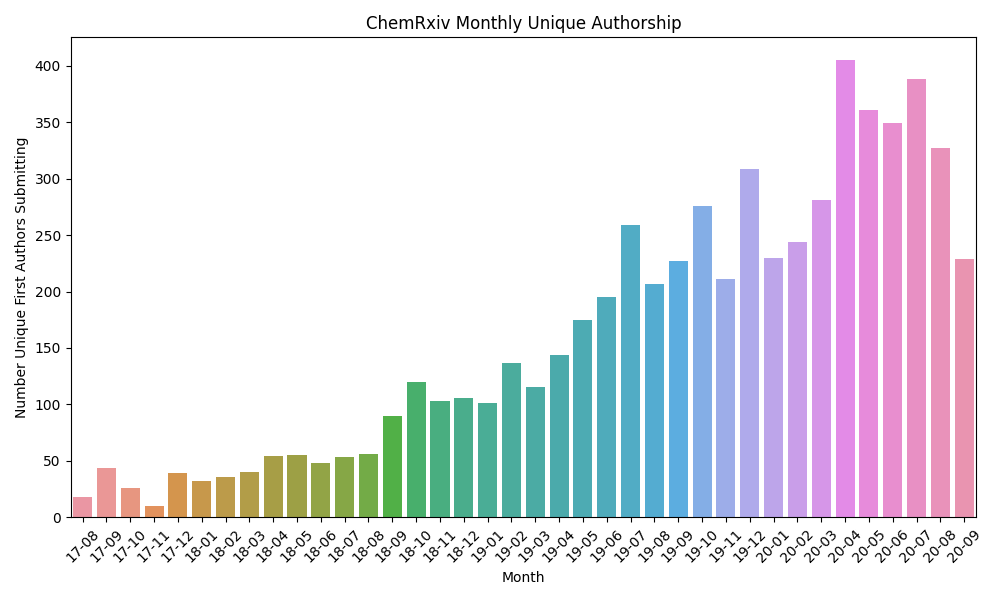
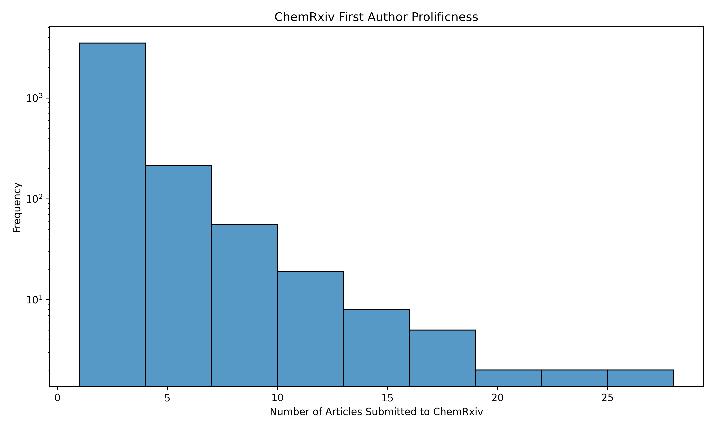
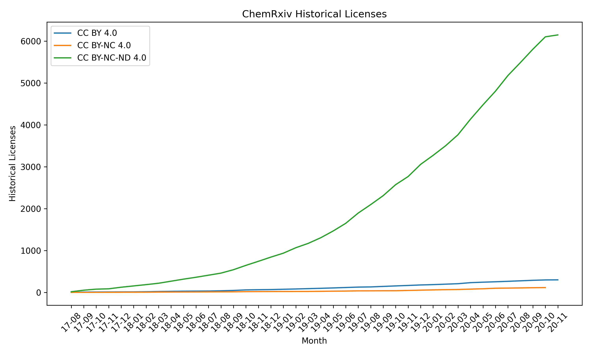
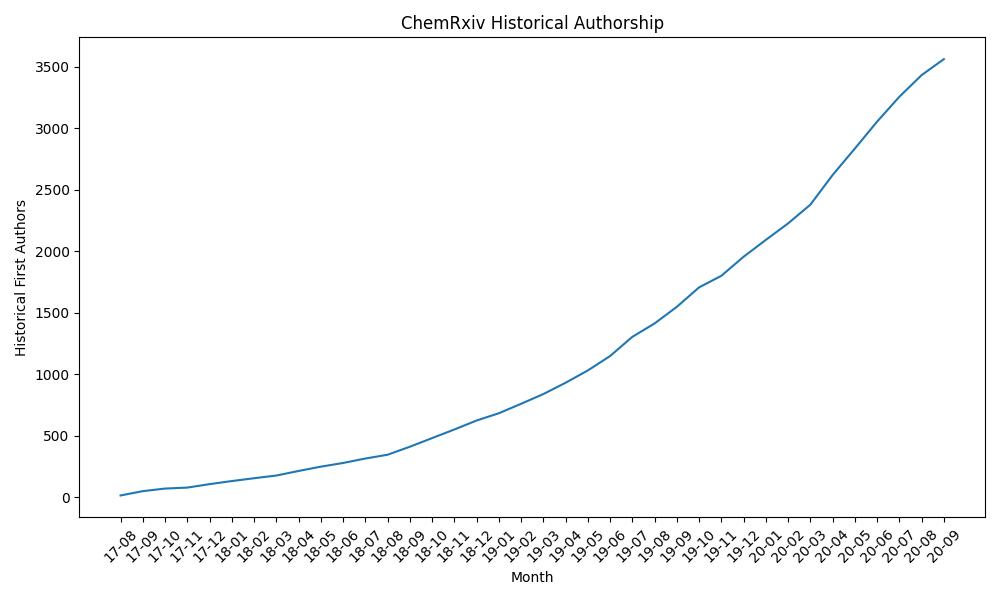

# chemrxiv-summarize

Motivated by <blockquote class="twitter-tweet" data-partner="tweetdeck"><p lang="en" dir="ltr">makes me wonder about the stats at <a href="https://twitter.com/ChemRxiv?ref_src=twsrc%5Etfw">@ChemRxiv</a> <a href="https://t.co/Ml5X8F4ckJ">https://t.co/Ml5X8F4ckJ</a></p>&mdash; Egon Willighⓐgen (@egonwillighagen) <a href="https://twitter.com/egonwillighagen/status/1219193083792969728?ref_src=twsrc%5Etfw">January 20, 2020</a></blockquote>

this repo summarize usage of ChemRxiv by using Figshare's API endpoint.

I've already run the download script on 2020-11-02. The scripts
can be run in this order to get nice charts.

```bash
pip install -r requirements.txt
python 01_download.py
python 02_process.py
python 03_visualize.py
```

Downloading takes a bit of time (40 minutes, maybe?) but there's
a tqdm bar to keep you entertained in the mean time.

**See also** the [ChemRxiv dashboard](https://chemrxiv-dashboard.github.io)
([source code](https://github.com/chemrxiv-dashboard/chemrxiv-dashboard.github.io))
that displays similar statistics and is automatically updated daily.

## Charts

How many authors have contributed per month to ChemRxiv?
This only counts using the ORCID iDs of the first authors;
it's pretty inconsistent what other identifying information
is included in the metadata for each article.



If we aggregate that data, we can ask how many authors have
submitted lots of articles:



The following chart shows the popularity of different licenses
over time:



Finally, we can take the first date of authorship for each
author then count at each month how many unique first time
authors there are. Then, we can use a cumulative sum to show
how many authors have contributed to ChemRxiv at any point in
time.


