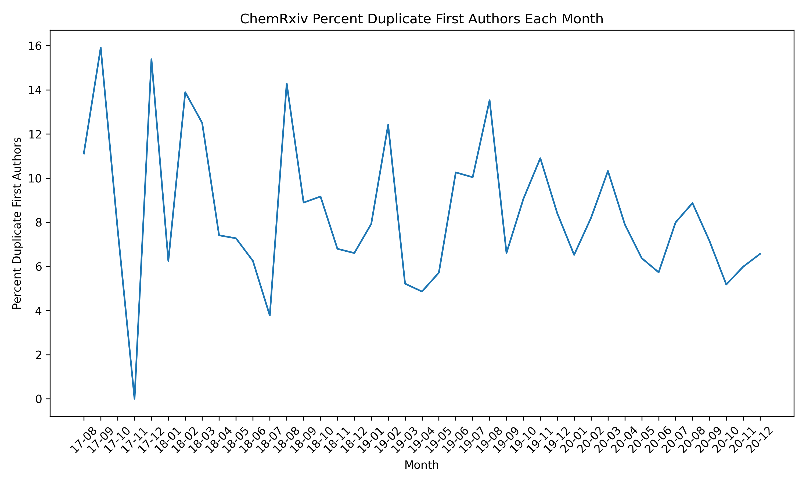
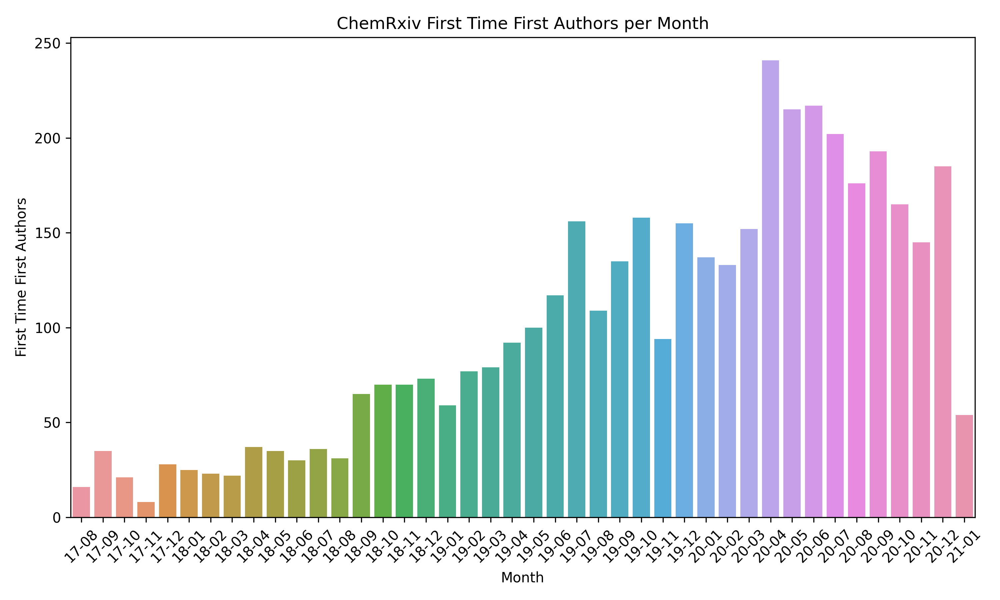

# chemrxiv-summarize

Motivated by <blockquote class="twitter-tweet" data-partner="tweetdeck"><p lang="en" dir="ltr">makes me wonder about the stats at <a href="https://twitter.com/ChemRxiv?ref_src=twsrc%5Etfw">@ChemRxiv</a> <a href="https://t.co/Ml5X8F4ckJ">https://t.co/Ml5X8F4ckJ</a></p>&mdash; Egon Willighⓐgen (@egonwillighagen) <a href="https://twitter.com/egonwillighagen/status/1219193083792969728?ref_src=twsrc%5Etfw">January 20, 2020</a></blockquote>

this repo summarize usage of ChemRxiv by using Figshare's API endpoint.

I've already run the download script on 2020-11-02. The scripts
can be run in this order to get nice charts.

```bash
pip install -r requirements.txt
python 01_download.py
python 02_process.py
python 03_visualize.py
```

Downloading takes a bit of time (40 minutes, maybe?) but there's
a tqdm bar to keep you entertained in the mean time.

I did a full write-up on the experience of writing this code and the results
in [this blog post](https://cthoyt.com/2020/04/15/summarizing-chemrxiv.html).

**See also** the [ChemRxiv dashboard](https://chemrxiv-dashboard.github.io)
([source code](https://github.com/chemrxiv-dashboard/chemrxiv-dashboard.github.io))
that displays similar statistics and is automatically updated daily.

## Charts

How many papers were submitted each month to ChemRxiv?


How many unique authors have contributed per month to ChemRxiv?
This only counts using the ORCID iDs of the first authors;
it's pretty inconsistent what other identifying information
is included in the metadata for each article.


How many authors submitted more than once per month? This
chart shows spikes in August, which I will guess is when
most people are submitting before their summer breaks :) 



How many authors contributed for their first time each month?



How many first authors have historically contributed to ChemRxiv
at each month? We can take the first date of authorship for each
author then count at each month how many unique first time
authors there are. Then, we can use a cumulative sum to show
how many authors have contributed to ChemRxiv at any point in
time.


If we aggregate that data, we can ask how many authors have
submitted lots of articles:


### Licensing

The following chart shows the popularity of different licenses
over time:


### Gender Related

The [gender-guesser](https://pypi.org/project/gender-guesser/) package
was used to infer authors' genders based on their first name. This
obviously comes with the caveat that some names can't be automatically
assigned to the male/female dichotomy. The "mostly male" and "mostly female"
results were respectively grouped with the male and female names. The
"androgenous" results were evenly split between male and female. 

The first chart shows the first author frequencies inferred as male,
female, and unknown.


This chart shows the percentage of male first authors with respect
to male + female first authors. It shows that even as the number of
submissions changes, the ratio still is quite skewed towards male
first authorship. Notably, there are no change in patterns during
the first COVID-19 pandemic lockdown (April-August 2020).


